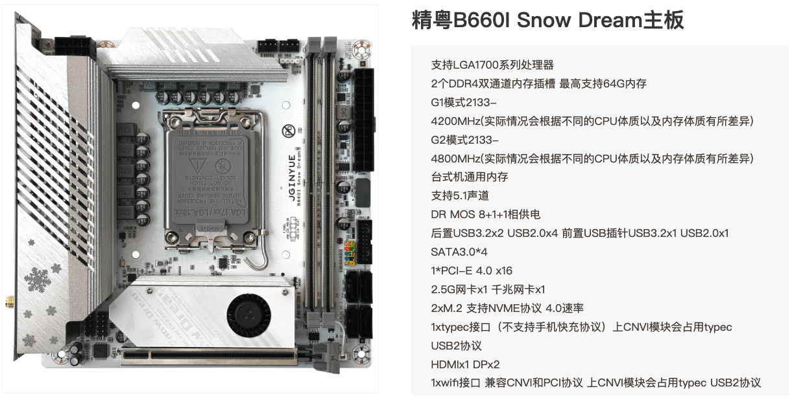

# JINGYUE-B660I-SNOW-DREAM-OpenCore-Hackintosh



### [简体中文](./README_CN.md)

## OpenCore

### [OpenCore 1.0.2](https://github.com/acidanthera/OpenCorePkg)

## OS Version Tested

+ MacOS Sequoia 15.x

## Hardware

+ Motherboard: JINGYUE B660I Snow Dream D4
+ Bios: Version JYI76008 03/10/2023
+ CPU: Intel 12th I5-12490F
+ RAM: JUHOR 16G DDR4 3200Mhz * 2
+ SSD: Fanxiang S500 Pro 2TB
+ GPU: ASRock RX6600 CLD ITX 8G GDDR6
+ Audio: Realtek ALC897
+ Ethernet Card: Realtek RTL8125 Gaming 2.5GbE
+ Ethernet Card: Realtek RTL8168H/8111H
+ WIFI: Intel AX201

## Notes

+ Use [OCAuxiliaryTools](https://github.com/ic005k/OCAuxiliaryTools) build your SMBIOS
+ Intel WiFi driver [itlwm.kext](https://github.com/OpenIntelWireless/itlwm/releases) in this EFI is applicable MacOS 12-15. Connect WiFi Please download [HeliPort.dmg](https://github.com/OpenIntelWireless/HeliPort/releases/download/v2.0.0-alpha/HeliPort.dmghttps://github.com/OpenIntelWireless/HeliPort/releases/download/v2.0.0-alpha/HeliPort.dmg).
+ Intel Not Supported Airdrop

## BIOS Setup
```
Advanced
  |-- CPU Configuration
     |-- CPU Lock Configuration
	      |-- CFG Lock ：Disabled
	      
	Re-Size BAR Support：Disabled
           
  |-- CSM Configuration
     |-- CSM Support ：Disabled

BOOT
   |-- Secure Boot
      |-- Secure Boot ：Disabled 
```

## Thanks

Thanks [@WuLongMiTaoLaiYiDa](https://github.com/WuLongMiTaoLaiYiDa) for a lot of help for me to build this efi.

You can also follow up [BiliBili Account of @WuLongMiTaoLaiYiDa](https://space.bilibili.com/244390800) for more asy-to-understand tutorials。

Thanks the QQGroup below for help.


## Tools

- [Hackintool](https://github.com/headkaze/Hackintool)
- [OCAuxiliaryTools](https://github.com/ic005k/OCAuxiliaryTools) AKA `OCAT`.
- [OpenCore Configurator](https://mackie100projects.altervista.org/opencore-configurator/) AKA `OCC`.
- [gibMacOS](https://github.com/corpnewt/gibMacOS) Build your own MacOS image.
- [ProperTree](https://github.com/corpnewt/ProperTree) Plist editor.
